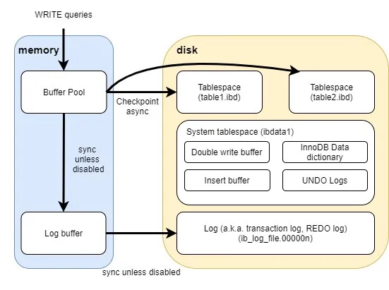

## MySQL Basic: 
MySQL is a popular open-source relational database management system (RDBMS) commonly used for web development, enterprise applications, and more. InnoDB is the default storage engine for MySQL database, known for its reliability, transactional support, and concurrency control mechanisms. It is widely used in production environments where data integrity, performance, and concurrency are crucial requirements.

### MySQL Editions Overview:

#### 1. MySQL Community Edition (Free): 
MySQL Community Edition is the world's most popular open-source database that can be downloaded for free. Individuals and organizations can utilize it for a variety of purposes.

The Community Edition has several restrictions, including a lack of advanced features like backup and recovery, performance monitoring, and security advancements in the Enterprise Edition. You will not, however, receive official assistance from the MySQL development team. 

**_Most commonly used version:_**
- Open-source (GPL license)
- Free to use
- Suitable for development, small to medium production
- Includes:
    - InnoDB storage engine
    - Replication
    - Partitioning
    - Performance Schema
    - Basic security features
- 📌 Best for: Developers, startups, learning, personal projects.


#### 2. MySQL Standard Edition:
MySQL Standard Edition is a paid version that provides extra analytics capabilities and support services. It contains all of MySQL's fundamental functionality and some extras like sophisticated backup and recovery, performance monitoring, and security upgrades.

This edition's cost is determined by the number of processors used, with discounts possible for more extensive deployments. MySQL Standard Edition costs different amounts based on the number of servers and cores. 

InnoDB is included in MySQL Standard Edition, making it a fully integrated transaction-safe, ACID-compliant database. Furthermore, MySQL Replication enables you to deliver high-performance, scalable web applications.

_Common feauters:_
- Basic commercial support
- Fewer enterprise tools than Enterprise Edition
- Production-ready with support subscription
- 📌 Best for: Companies that need support but not advanced security tools.


#### 3. MySQL Enterprise Edition:
MySQL Enterprise Edition provides additional features and support services such as high availability, security, and speed enhancements. MySQL Enterprise Edition costs different amounts based on the number of servers and cores. 

MySQL Enterprise Edition is appropriate for mission-critical applications requiring enhanced capabilities for high availability, security, and performance optimization. 

_Includes everything in Community Edition plus:_
- MySQL Enterprise Backup (hot backup)
- MySQL Enterprise Monitor
- MySQL Firewall
- Data Masking & De-Identification
- Advanced Security (TDE – Transparent Data Encryption)
- Oracle Premier Support
- 📌 Best for: Large enterprises, banking, telecom, critical production systems.


#### 4. MySQL Cluster (NDB Cluster):

- Designed for high availability & distributed environments
- Real-time performance
- Uses NDB (Network Database) storage engine
- Often used in telecom systems
- 📌 Best for: High availability, low-latency systems.


### Key Advantages of InnoDB:

- Its DML operations follow the ACID (`atomicity`, `consistency`, `isolation`, `durability`) model, with transactions featuring commit, rollback, and crash-recovery capabilities to protect user data.
- Row-level locking and Oracle-style consistent reads increase multi-user concurrency and performance.
- InnoDB tables arrange your data on disk to optimize queries based on primary keys. Each InnoDB table has a primary key index called the clustered index that organizes the data to minimize I/O for primary key lookups.
- To maintain data integrity, InnoDB supports FOREIGN KEY constraints. With foreign keys, inserts, updates, and deletes are checked to ensure they do not result in inconsistencies across related tables.


_InnoDB Basic Diagram:_




### System Databases:
- mysql
- sys
- performance_schema
- information_schema


### Default Files:
- system tablespace for innodb
- table data pages
- table index pages
- MVCC control data


### Innodb Files:
InnoDB, as a storage engine for MySQL and MariaDB, stores table data in two types of files:

- `.frm` :  That store the table structure (schema), including column definitions (data types), indexes, and other metadata.
- `.ibd` :	These are InnoDB data files that store the actual table data and indexes.  InnoDB stores all tables and indexes in a shared tablespace.


### Redo logs:
The redo log is used by InnoDB during crash recovery and background flushing of transactions to the tablespaces. The redo log files have names like `ib_logfileN`, where N is an integer.

- ib_logfile0
- ib_logfile1


### Binlog Files:
The binary log (binlog) in MySQL and MariaDB is a file where database changes are recorded in a binary format.

- binlog.000001
- binlog.000002


### Show variables: 

To display the current configuration variables in MySQL or MariaDB, you can use the SHOW VARIABLES command. This command retrieves the current values of server system variables. Here's how you can use it:

```
select version();
```


```
show status;
show processlist;
```


```
select @@datadir;

+-----------------+
| @@datadir       |
+-----------------+
| /var/lib/mysql/ |
+-----------------+
```


```
show variables;
show variables like "basedir";
show variables like "datadir";
show variables like '%log_bin%';
show variables like "port";
show variables like 'server_id';
```


```
show variables like 'validate_password%';

SET GLOBAL validate_password.length = 6;
SET GLOBAL validate_password.number_count = 0;
SET GLOBAL validate_password.policy = 0;
```


```
SHOW VARIABLES LIKE "secure_file_priv";

+------------------+-----------------------+
| Variable_name    | Value                 |
+------------------+-----------------------+
| secure_file_priv | /var/lib/mysql-files/ |
+------------------+-----------------------+
```


```
ll /var/lib/mysql-files/
```


```
show binary logs;
show binlog events;

SHOW VARIABLES LIKE 'log_bin';
SHOW VARIABLES LIKE 'binlog_format';
```


---
---


### Basic command for InnoDB: 

```
show engines;

SELECT * FROM INFORMATION_SCHEMA.ENGINES;
```


```
SELECT @@default_storage_engine;

+--------------------------+
| @@default_storage_engine |
+--------------------------+
| InnoDB                   |
+--------------------------+
```


```
SHOW ENGINE INNODB STATUS;
SHOW ENGINE INNODB STATUS\G


SHOW VARIABLES LIKE 'innodb%';

show variables like 'innodb_directories';

+--------------------+-------+
| Variable_name      | Value |
+--------------------+-------+
| innodb_directories |       |
+--------------------+-------+


SHOW GLOBAL VARIABLES like 'innodb_file_per_table';

+-----------------------+-------+
| Variable_name         | Value |
+-----------------------+-------+
| innodb_file_per_table | ON    |
+-----------------------+-------+


SELECT @@innodb_file_per_table;

+-------------------------+
| @@innodb_file_per_table |
+-------------------------+
|                       1 |
+-------------------------+


SHOW VARIABLES LIKE 'innodb_data_file_path';
SHOW VARIABLES LIKE 'innodb_page_size';
```


```
SELECT @@datadir,@@innodb_data_home_dir,@@innodb_directories;

+-----------------+------------------------+----------------------+
| @@datadir       | @@innodb_data_home_dir | @@innodb_directories |
+-----------------+------------------------+----------------------+
| /var/lib/mysql/ | NULL                   | NULL                 |
+-----------------+------------------------+----------------------+
```


---
---


### Tablespaces:

InnoDB tablespaces are an essential component of the InnoDB storage engine in MySQL and MariaDB. They are used to manage the storage of table data, indexes, and other internal structures.

1. **System Tablespace::** The system tablespace is the primary storage area for InnoDB data files. It contains data dictionary information, metadata, and internal data structures necessary for managing InnoDB tables. By default, the system tablespace consists of one or more data files named **`ibdata1`**, **`ibdata2`**, etc.

2. **File-Per-Table Tablespaces:** In addition to the system tablespace, InnoDB supports file-per-table tablespaces. Each InnoDB table and its associated indexes can be stored in a separate file-per-table tablespace. These tablespaces have the file extension **`.ibd`**

3. **Undo Tablespace:** InnoDB uses an undo tablespace to store information necessary for supporting transactions and MVCC (Multi-Version Concurrency Control). Undo tablespaces manage data modifications, rollback segments, and transaction history. By default, the undo tablespace is named **`ib_undo_001`**

4. **Temporary Tablespace:** InnoDB uses a temporary tablespace to store temporary data for operations such as sorting and grouping. Temporary tablespaces are used for temporary tables, temporary table copies, and internal temporary tables created during query execution.

5. **General Tablespace (MySQL 8.0+):** Introduced in MySQL 8.0, general tablespaces provide a way to create user-defined tablespaces for storing InnoDB tables and indexes. General tablespaces offer flexibility in managing table storage and can span multiple data files.


```
mysql> show databases;
+--------------------+
| Database           |
+--------------------+
| Northwind          |
| classicmodels      |
| information_schema |
| mysql              |
| performance_schema |
| sys                |
+--------------------+
```


```
use <database_name>;
show tables;
desc <table_name>;
```


```
create database db1;
CREATE TABLE test1 (name VARCHAR(20));
INSERT INTO test1 (name) VALUES ('jaber');
```


```
# ll /var/lib/mysql/db1/
  -rw-r-----  1 mysql mysql 112K May  8 15:32 test1.ibd
```


```
SHOW TABLE STATUS;
SHOW TABLE STATUS FROM db1 WHERE Name='test1'\G
```


```
desc information_schema.FILES;
SELECT * FROM information_schema.FILES;
SELECT TABLESPACE_NAME, FILE_NAME FROM information_schema.FILES;
SELECT TABLESPACE_NAME, FILE_NAME, ENGINE FROM information_schema.FILES;
```


```
### Check System Tablespace:

SELECT TABLESPACE_NAME, FILE_NAME FROM information_schema.FILES WHERE FILE_NAME LIKE "%ibdata1";

+-----------------+-----------+
| TABLESPACE_NAME | FILE_NAME |
+-----------------+-----------+
| innodb_system   | ./ibdata1 |
+-----------------+-----------+
```


### Creating a General Tablespace:


```
### Syntax:
CREATE TABLESPACE tablespace_name;


### File name like: "2a942464-1059-11ef-9bc9-000c29807c86.ibd"

CREATE TABLESPACE sample_tablespace;
CREATE TABLESPACE sample_tablespace Engine = InnoDB;

drop tablespace sample_tablespace;
```


**Creating a general tablespace in the data directory:**

```
CREATE TABLESPACE myts1 ADD DATAFILE 'myts1.ibd';
CREATE TABLESPACE myts2 ADD DATAFILE 'myts2.ibd' ENGINE = INNODB;
```


### Creating a general tablespace in a directory outside of the data directory:

```
CREATE TABLESPACE myts3 ADD DATAFILE '/var/lib/mysql/db1/myts3.ibd' ENGINE = INNODB;
```


```
select * from INFORMATION_SCHEMA.FILES where TABLESPACE_NAME ='myts1'\G;

SELECT TABLESPACE_NAME, FILE_NAME FROM information_schema.FILES WHERE FILE_NAME LIKE "%myts%";

+-----------------+-------------+
| TABLESPACE_NAME | FILE_NAME   |
+-----------------+-------------+
| myts1           | ./myts1.ibd |
| myts2           | ./myts2.ibd |
+-----------------+-------------+
```


```
create table test2(id int) TABLESPACE=myts2;
INSERT INTO test2 (id) VALUES (1);
```


```
# ll /var/lib/mysql/db1
  -rw-r-----  1 mysql mysql 112K May  8 15:32 test1.ibd
```


```
# ll /var/lib/mysql/myts*
-rw-r----- 1 mysql mysql 112K May  8 15:26 /var/lib/mysql/myts1.ibd
-rw-r----- 1 mysql mysql 112K May  8 15:26 /var/lib/mysql/myts2.ibd
```


```
### Tablespace `myts2` is not empty. Cause first delete table then delete the tablespace.

drop table test2;
drop tablespace myts2;
```


---
---


### Basic Database operations:

```
### Create Database:

create database db2;
```


```
show tables;
desc <table_name>;
describe <table_name>;
```


```
### Drop Database:

drop database db2;
```


```
### Drop Table:

drop table <table_name>;
```


### Set System Variables:

In MySQL, system variables can be categorized into two types based on their scope: session variables and global variables.

**1. Global System Variables:**

- Global system variables affect the entire MySQL or MariaDB server instance.
- Changes made to global variables persist across all sessions and connections.
- These variables are typically set in the server configuration file (e.g., my.cnf or my.ini) or modified dynamically using the `SET GLOBAL` command.
- Examples of global variables include innodb_buffer_pool_size, max_connections, and query_cache_size.


**2. Session System Variables:**

- Session system variables are specific to individual client sessions.
- Each session (connection) to the database server has its own set of session variables, which can be different from those of other sessions.
- Changes made to session variables only affect the current session and do not impact other sessions.
- Session variables can be set using the `SET` statement within a session or in client applications.
- Examples of session variables include autocommit, sql_mode, and time_zone.


_**Here's a summary of the differences between global and session system variables:**_

- Scope: Global variables affect the entire server instance, while session variables are specific to individual client sessions.

- Persistence: Changes to global variables persist across server restarts, while changes to session variables are temporary and last only for the duration of the session.

- Setting: Global variables are typically set in the server configuration file or modified using the SET GLOBAL command, while session variables are set using the SET statement within a session or in client applications.

- Impact: Changes to global variables affect all sessions, while changes to session variables only affect the current session.


### Linked Table Drop:

If you want to delete a table and get a foreign key error. ERROR 3730 (HY000): Cannot drop table 'products' referenced by a foreign key constraint 'orderdetails_ibfk_2' on table 'orderdetails'. Do as below: 

```
### Set a session system variable:

SET foreign_key_checks=0;

or,


### Set a global system variable:

SET GLOBAL foreign_key_checks=0;


show variables like "foreign_key%";

+--------------------+-------+
| Variable_name      | Value |
+--------------------+-------+
| foreign_key_checks | OFF   |
+--------------------+-------+


drop table products;
```


```
### DROP Column:

ALTER TABLE <table_name> DROP <column_name>;
```


```
### ADD Column

ALTER TABLE <table_name> ADD <column_name> datatype;
```


```
### To change the data type of a column in a table:

ALTER TABLE table_name MODIFY COLUMN <column_name> datatype;


ALTER TABLE Persons ADD DateOfBirth date;

ALTER TABLE Persons MODIFY COLUMN DateOfBirth year;
```


```
### UPDATE:

UPDATE <table_name>
SET <comlumn_name> = <value>
WHERE <condition>;
```


The following statement uses the `COUNT(*)` function to return all rows from the `payments` table:
```
### COUNT: 

select count(column_name) from payments;
select count(*) from payments;
select count(amount) from payments;
```


This example uses the` MAX()` function to return the largest `amount` of all payments:
```
### MAX:

SELECT MAX(amount) FROM payments;
SELECT MAX(paymentDate) FROM payments;
```


```
### DELETE Row:

DELETE FROM <table_name> WHERE <condition>;

delete from region where id = "1" ;
```


```
### Delete All Records from table:

DELETE FROM <table_name>;
DELETE FROM region;
```


### Database Size:
Get the Size for all Databases: 

```
SELECT TABLE_SCHEMA AS `Database`,
ROUND(SUM(DATA_LENGTH + INDEX_LENGTH) / 1024 / 1024, 2) AS `Size (MB)` 
FROM information_schema.TABLES
GROUP BY TABLE_SCHEMA 
ORDER BY SUM(DATA_LENGTH + INDEX_LENGTH) DESC;

+--------------------+-----------+
| Database           | Size (MB) |
+--------------------+-----------+
| mysql              |      2.61 |
| Northwind          |      0.64 |
| classicmodels      |      0.42 |
| sys                |      0.02 |
| db1                |      0.02 |
| information_schema |      0.00 |
| performance_schema |      0.00 |
+--------------------+-----------+
```


Get the Size for a Single Database:

```
SELECT TABLE_SCHEMA AS `Database`,
ROUND(SUM(DATA_LENGTH + INDEX_LENGTH) / 1024 / 1024, 2) AS `Size (MB)` 
FROM information_schema.TABLES
WHERE TABLE_SCHEMA="classicmodels";

+---------------+-----------+
| Database      | Size (MB) |
+---------------+-----------+
| classicmodels |      0.42 |
+---------------+-----------+
```


Get Table Size for a Single Database:

```
SELECT TABLE_NAME AS `Table`,
ROUND(((DATA_LENGTH + INDEX_LENGTH) / 1024 / 1024), 2) AS `Size (MB)` 
FROM information_schema.TABLES 
WHERE table_schema = "classicmodels" 
ORDER BY (data_length + index_length) DESC;

+--------------+-----------+
| Table        | Size (MB) |
+--------------+-----------+
| orderdetails |      0.23 |
| orders       |      0.06 |
| employees    |      0.05 |
| customers    |      0.03 |
| offices      |      0.02 |
| payments     |      0.02 |
| productlines |      0.02 |
+--------------+-----------+
```


### Slow query log:


### General log:

To effectively perform these tasks, you should have a strong understanding of database concepts, SQL querying, system administration, networking, and security principles. Additionally, staying updated with the latest MySQL developments, best practices, and security vulnerabilities is essential for maintaining a secure and efficient database environment.


### Links:

- [InnoDB Limitations](https://mariadb.com/kb/en/innodb-limitations/)
- [Best Practices for InnoDB](https://docs.oracle.com/cd/E17952_01/mysql-8.0-en/innodb-best-practices.html)
- [General Tablespaces](https://dev.mysql.com/doc/refman/8.0/en/general-tablespaces.html)


